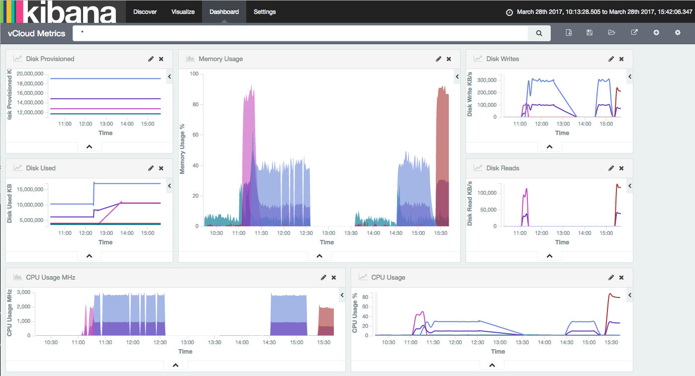

vCloud Director Utilisation Metrics
============
The UKCloud ECC platform (regions 5 & 6 only) expose VM utilisation metrics via an API endpoint. The metrics API is documented in [the knowledge centre](https://portal.skyscapecloud.com/support/knowledge_centre/964d37e0-0dfe-45a6-ae8d-733144e78d3e) - to summarise though, you have to make a HTTP GET request to the API for every VM, and the response you receive back is an XML structure that is not easy to process into an ELK stack or similar.
``` shell
GET https://api.vcd.portal.skyscapecloud.com/api/vApp/vm-12345678-aaaa-bbbb-cccc-1234567890ab/metrics/current

<CurrentUsage xmlns="http://www.vmware.com/vcloud/v1.5" ...>
          <Link
             rel="up"
             href="https://api.vcd.portal.skyscapecloud.com/api/vApp/vm-12345678-
       aaaa-bbbb-cccc-1234567890ab"
             type="application/vnd.vmware.vcloud.vm+xml">
          <Metric name="cpu.usage.average"
             unit="PERCENT"
             value="0.1"/>
          <Metric name="cpu.usage.maximum"
             unit="PERCENT"
             value="0.1"/>
          <Metric name="cpu.usagemhz.average"
             unit="MEGAHERTZ"
             value="2.0"/>
          <Metric name="mem.usage.average"
             unit="PERCENT"
             value="0.0"/>
          <Metric name="disk.write.average"
             unit="KILOBYTES_PER_SECOND"
             value="0.0"/>
          <Metric name="disk.read.average"
             unit="KILOBYTES_PER_SECOND"
             value="0.0"/>
          <Metric name="disk.provisioned.latest"
             unit="KILOBYTE"
             value="45410433"/>
          <Metric name="disk.used.latest"
             unit="KILOBYTE"
             value="111744.0"/>
       </CurrentUsage>
```


----------

The vcloud-metrics MicroService
-------------------------------
This is a microservice to mine the vCloud Director Metrics API and return a usable JSON structure intended for injecting directly into elastic search, using the logstash configuration also provided here. We have also provided some exported searches, visualisations and a dashboard that you can import into Kibana.



The microservice requires a JSON string containing the vCloud API endpoint and your user credentials:

```
{ "vcd_api_url": "https://api.vcd.z0000f.r00006.frn.portal.skyscapecloud.com/api",
  "vcd_username": "1234.1.456789@1-1-11-123456",
  "vcd_password": "Sup3rS3creT" }
```

This JSON is then POST'ed to the microservice /stats endpoint:

```
  curl -X POST -d @vcloud-creds.json http://vcloud-metrics-url/stats
```

The microservice uses the vCloud Query API to enumerate all VM instances in your account and iteratively call the relevant /metrics/current endpoint. All the metrics are returned as a JSON list structure:

```
[{"name":"cpu.usage.average","unit":"PERCENT","value":"0.09","vm_name":"node02.devops.ukcloud.com"},
{"name":"cpu.usage.maximum","unit":"PERCENT","value":"0.09","vm_name":"node02.devops.ukcloud.com"},
{"name":"cpu.usagemhz.average","unit":"MEGAHERTZ","value":"8.0","vm_name":"node02.devops.ukcloud.com"},
{"name":"disk.provisioned.latest","unit":"KILOBYTE","value":"19044612","vm_name":"node02.devops.ukcloud.com"},
{"name":"mem.usage.average","unit":"PERCENT","value":"0.0","vm_name":"node02.devops.ukcloud.com"},
{"name":"disk.used.latest","unit":"KILOBYTE","value":"10301699","vm_name":"node02.devops.ukcloud.com"},
{"name":"disk.write.average","unit":"KILOBYTES_PER_SECOND","value":"0.0","vm_name":"node02.devops.ukcloud.com"},
{"name":"disk.read.average","unit":"KILOBYTES_PER_SECOND","value":"0.0","vm_name":"node02.devops.ukcloud.com"},
...
]
```


----------

Running the MicroService
------------------------
The service has been implemented using Ruby's [Sinatra framework](http://www.sinatrarb.com/) and [Rack infrastructure](http://rack.github.io/). You can run a local instance of the service either by executing the vcloud.rb script directly, or by utilising rack's "rackup" command:

```
#> git clone https://github.com/UKCloud/vcloud-metrics.git
#> cd vcloud-metrics
#> bundle install
#> bundle exec rackup
Puma starting in single mode...
* Version 3.4.0 (ruby 2.0.0-p648), codename: Owl Bowl Brawl
* Min threads: 0, max threads: 16
* Environment: development
* Listening on tcp://localhost:9292
Use Ctrl-C to stop
```

The service has been intended to run as a container though, with the development being done against [OpenShift Origin](https://www.openshift.org/). You can quickly [deploy a pre-configured all-in-one openshift environment](https://github.com/openshift/origin/blob/master/docs/cluster_up_down.md) by using the "oc cluster up" command.

Once you have an OpenShift cluster ready to use, you can deploy the vcloud-metrics microservice in a new project by running:

```
#> oc new-project vcloud
#> oc new-app https://github.com/ukcloud/vcloud-metrics.git --name metrics
#> oc expose service metrics
#> oc status
In project vcloud on server https://192.168.99.100:8443

http://metrics-vcloud.192.168.99.100.xip.io to pod port 8080-tcp (svc/metrics)
  dc/metrics deploys istag/metrics:latest <-
    bc/metrics source builds https://github.com/ukcloud/vcloud-metrics.git on openshift/ruby:2.3
    deployment #1 deployed 28 seconds ago - 1 pod

View details with 'oc describe <resource>/<name>' or list everything with 'oc get all'.
```


----------

vCloud Utilisation Metrics in Elastic Search
--------------------------------------------

Now we have the vCloud metrics in an easily consumable JSON format, we can configure Logstash to consume the metrics generated by the microservice. 

For demonstration purposes, the following steps will show you how to run the E.L.K. stack containerised in the same OpenShift instance as the vcloud-metrics service, however in production use, you are likely to want to use a different strategy for deploying Elastic Search. For speed and simplicity, we can leverage the work done by https://github.com/lbischof/openshift3-elk that already provides docker containers for the 3 components.

```
#> oc new-app lbischof/kibana
#> oc new-app lbischof/elasticsearch
#> oc expose service kibana
```

To pass our custom configuration into the Logstash container, we first need to inject our vCloud credentials into the container as environment variables. Save them into a file using the following standard key-value pairs:

```
VCD_API_HOST=api.vcd.z0000f.r00006.frn.portal.skyscapecloud.com
VCD_USERNAME=1234.1.456789
VCD_ORG=1-1-11-123456
VCD_PASSWORD=Sup3rS3creT
```

Then we can launch the logstash container, pulling in our configuration and environment variables with:

```
#> oc new-app lbischof/logstash~https://github.com/ukcloud/vcloud-metrics.git --context-dir logstash --name logstash-git --env-file=vcloud-creds.txt
```
